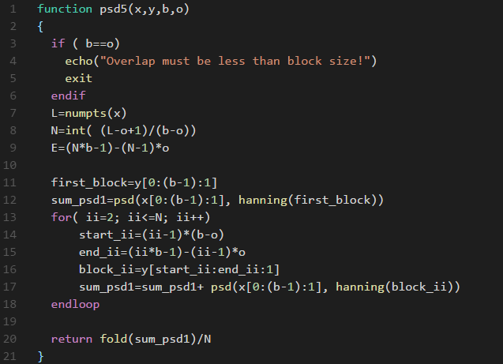
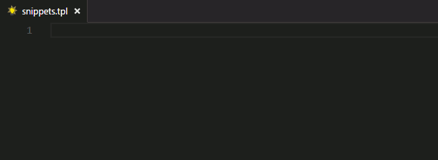

# Templex Language Definition for VSCode

This package provides the following features for Templex files in VSCode:
- Syntax highlighting
- Snippets 

## Features

### Syntax highlighting

### Snippets

