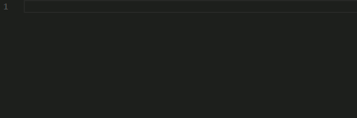

# Templex Language Support for VSCode

This package provides the following features for Templex files in VSCode:
- Syntax highlighting / Colorization
- Snippets 

## Features

### Syntax highlighting

### Snippets

